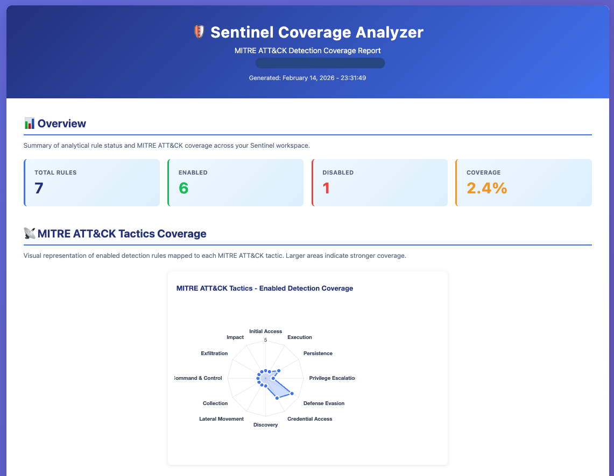
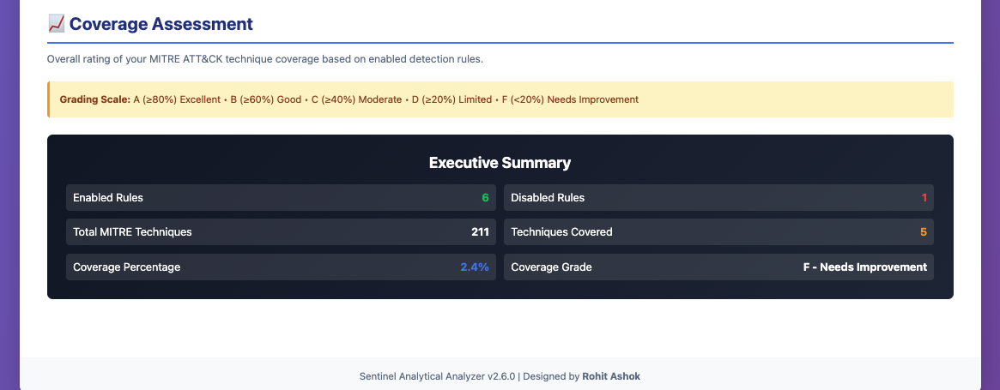

# 🛡️ Sentinel MITRE ATT&CK Coverage Analyzer

[](https://github.com/PowerShell/PowerShell)
[](LICENSE)
[](https://azure.microsoft.com/en-us/services/azure-sentinel/)

> **Professional MITRE ATT&CK coverage analysis for Azure Sentinel with interactive HTML reports**

Analyze your Azure Sentinel analytical rules and generate comprehensive MITRE ATT&CK coverage reports with beautiful visualizations, including interactive radar charts, gap analysis, and executive summaries.


---

## 📑 Table of Contents

- [Features](#-features)
- [Prerequisites](#-prerequisites)
- [Installation](#-installation)
- [Quick Start](#-quick-start)
- [Usage](#-usage)
- [Report Sections](#-report-sections)
- [Azure Permissions](#-azure-permissions)
- [Examples](#-examples)
- [Troubleshooting](#-troubleshooting)
- [Reference Report ScreenShots](#-Reference)
- [License](#-license)
- [Author](#-author)

---

## ✨ Features

### 📊 **Comprehensive Analysis**
- ✅ Total, enabled, and disabled rule counts with percentages
- ✅ MITRE ATT&CK technique coverage (against 211 official techniques)
- ✅ Automatic sub-technique rollup (T1547.002 → T1547)
- ✅ Custom vs Gallery rule breakdown
- ✅ Coverage grading (A-F scale)

### 📡 **Interactive Visualizations**
- ✅ Radar/spider chart showing tactic coverage
- ✅ Color-coded severity badges
- ✅ Distribution bars and progress indicators
- ✅ Responsive design (works on mobile)

### 📋 **Detailed Reporting**
- ✅ Disabled rules with MITRE tactics
- ✅ Rules without MITRE mapping
- ✅ Enabled rules per tactic table
- ✅ Gap analysis (tactics needing attention)
- ✅ Executive summary dashboard

### 💾 **Export Options**
- ✅ Professional HTML reports (saved to Downloads folder)
- ✅ Print-optimized styling

---

## 📋 Prerequisites

### Required
- **PowerShell**: Version 5.1 or later
- **Azure Access**: Active Azure subscription with Sentinel deployed
- **Authentication**: One of the following:
  - Azure PowerShell module (`Az`)
  - Azure CLI
  - Managed Identity (for Azure-hosted environments)

### Azure Permissions
Your Azure account must have **one** of these roles on the Sentinel workspace:

| Role | Scope | Description |
|------|-------|-------------|
| **Microsoft Sentinel Reader** | Workspace | Read access to Sentinel data (minimum required) |
| **Microsoft Sentinel Responder** | Workspace | Includes Reader + incident management |
| **Microsoft Sentinel Contributor** | Workspace | Full access to Sentinel resources |
| **Reader** | Subscription/RG | Alternative: Read access at higher scope |


---

## 🚀 Installation

### Method 1: Clone from GitHub

```powershell
# Clone the repository
git clone https://github.com/rohit8096-ag/sentinel-mitre-analyzer.git
cd sentinel-mitre-analyzer

# Import the module
Import-Module .\SentinelMITREAnalyzer.psm1
```

### Method 2: Manual Installation

1. Download `SentinelMITREAnalyzer.psm1` and `SentinelMITREAnalyzer.psd1`
2. Place them in a folder (e.g., `C:\Tools\SentinelAnalyzer\`)
3. Import the module:

```powershell
Import-Module C:\Tools\SentinelAnalyzer\SentinelMITREAnalyzer.psm1
```

---

## ⚡ Quick Start

### Step 1: Authenticate to Azure

```powershell
# Option A: Using Az PowerShell (Recommended)
Install-Module Az -Scope CurrentUser -Force
Connect-AzAccount
Set-AzContext -SubscriptionId 'your-subscription-id'

# Option B: Using Azure CLI
az login
az account set --subscription 'your-subscription-id'
```

### Step 2: Run the Analyzer

```powershell
# Import the module
Import-Module .\SentinelMITREAnalyzer.psm1

# Generate HTML report (saves to Downloads folder)
Get-SentinelAnalyticalRulesReport -ExportHtml
```

### Step 3: View Your Report

The HTML report will be saved to:
- **Windows**: `C:\Users\YourName\Downloads\Sentinel Analytical Analyzer.html`
- **macOS/Linux**: `~/Downloads/Sentinel Analytical Analyzer.html`

Double-click to open in your browser!

---

## 📖 Usage

### Basic Usage

```powershell
# Interactive mode (prompts for inputs)
Get-SentinelAnalyticalRulesReport -ExportHtml

# You'll be prompted for:
# - Subscription ID
# - Resource Group
# - Workspace Name
```

### Non-Interactive Mode

```powershell
# Provide all parameters
Get-SentinelAnalyticalRulesReport `
    -SubscriptionId 'xxxxxxxx-xxxx-xxxx-xxxx-xxxxxxxxxxxx' `
    -ResourceGroup 'my-sentinel-rg' `
    -WorkspaceName 'my-sentinel-workspace' `
    -ExportHtml
```

---

## 📊 Report Sections

### 1. Overview
Summary statistics including total rules, enabled/disabled counts, and MITRE coverage percentage.

### 2. MITRE ATT&CK Tactics Coverage (Radar Chart)
Interactive spider/radar chart showing enabled rule coverage across all 14 MITRE tactics.

### 3. Enabled Rules by Tactic
Table displaying the number of enabled rules for each MITRE tactic with visual distribution bars.

### 4. Rule Source Breakdown
Analysis of rule origins:
- **Gallery Rules**: Microsoft-provided templates
- **Custom Rules**: Organization-created detections

### 5. Disabled Rules
Complete list of inactive rules with severity levels and MITRE tactic mappings.

### 6. Rules Without MITRE Mapping
Identification of rules lacking MITRE ATT&CK framework alignment.

### 7. Coverage Gaps
Gap analysis showing the top 5 tactics with the fewest enabled rules, prioritized by criticality.

### 8. Coverage Assessment
Overall MITRE technique coverage with grading:
- **A (≥80%)**: Excellent coverage
- **B (≥60%)**: Good coverage
- **C (≥40%)**: Moderate coverage
- **D (≥20%)**: Limited coverage
- **F (<20%)**: Needs improvement

### 9. Executive Summary
Consolidated dashboard with all key metrics including:
- Enabled/disabled counts
- Total MITRE techniques (211)
- Unique techniques covered
- Coverage percentage and grade

---

## 🔐 Azure Permissions

### Required API Permissions

The analyzer uses the **Azure Resource Manager REST API** to query Sentinel:

```
Endpoint: https://management.azure.com/subscriptions/{subscriptionId}/
          resourceGroups/{resourceGroupName}/providers/
          Microsoft.OperationalInsights/workspaces/{workspaceName}/
          providers/Microsoft.SecurityInsights/alertRules

API Version: 2024-09-01 (with fallback to older versions)
```

### Assigning Permissions

#### Via Azure Portal
1. Navigate to your **Log Analytics Workspace**
2. Click **Access control (IAM)**
3. Click **Add** → **Add role assignment**
4. Select **Microsoft Sentinel Reader**
5. Search for and select your user/service principal
6. Click **Save**

#### Via Azure CLI
```bash
# Get the workspace resource ID
WORKSPACE_ID=$(az monitor log-analytics workspace show \
  --resource-group my-rg \
  --workspace-name my-workspace \
  --query id -o tsv)

# Assign the role
az role assignment create \
  --assignee user@domain.com \
  --role "Microsoft Sentinel Reader" \
  --scope $WORKSPACE_ID
```

#### Via PowerShell
```powershell
# Get the workspace
$workspace = Get-AzOperationalInsightsWorkspace `
    -ResourceGroupName 'my-rg' `
    -Name 'my-workspace'

# Assign the role
New-AzRoleAssignment `
    -SignInName 'user@domain.com' `
    -RoleDefinitionName 'Microsoft Sentinel Reader' `
    -Scope $workspace.ResourceId
```

### Role Capabilities

| Action | Reader | Responder | Contributor |
|--------|--------|-----------|-------------|
| View analytical rules | ✅ | ✅ | ✅ |
| View rule properties | ✅ | ✅ | ✅ |
| View MITRE mappings | ✅ | ✅ | ✅ |
| Modify rules | ❌ | ❌ | ✅ |
| Create rules | ❌ | ❌ | ✅ |
| Delete rules | ❌ | ❌ | ✅ |

**Note**: This analyzer only requires **read access** (Reader role is sufficient).

---

## 💡 Examples

### Example 1: Quick Security Assessment

```powershell
# Generate report for quick review
Import-Module .\SentinelMITREAnalyzer.psm1
Get-SentinelAnalyticalRulesReport -ExportHtml

# Open report in default browser
Start-Process (Join-Path $env:USERPROFILE "Downloads\Sentinel Analytical Analyzer.html")
```

### Example 2: Find Coverage Gaps

```powershell
$report = Get-SentinelAnalyticalRulesReport

# Find tactics with zero coverage
$zeroCoverage = $report.TacticStats.GetEnumerator() | 
    Where-Object { $_.Value.EnabledCount -eq 0 }

foreach ($tactic in $zeroCoverage) {
    Write-Host "No coverage for: $($tactic.Key)" -ForegroundColor Red
}
```

### Example 3: Audit Disabled High-Severity Rules

```powershell
$report = Get-SentinelAnalyticalRulesReport

# Get high-severity disabled rules
$criticalDisabled = $report.Disabled | 
    Where-Object { $_.properties.severity -eq 'High' }

# Export to CSV
$criticalDisabled | 
    Select-Object @{N='Name';E={$_.properties.displayName}},
                  @{N='Tactics';E={$_.properties.tactics -join ', '}},
                  @{N='LastModified';E={$_.properties.lastModifiedUtc}} |
    Export-Csv 'Critical_Disabled_Rules.csv' -NoTypeInformation
```

---

## 🔧 Troubleshooting

### Issue: "Authentication failed"

**Symptoms**: Script fails at authentication step

**Solutions**:
```powershell
# Check if you're logged in
Get-AzContext  # For Az PowerShell
az account show  # For Azure CLI

# Re-authenticate
Connect-AzAccount
# or
az login

# Set correct subscription
Set-AzContext -SubscriptionId 'your-sub-id'
# or
az account set --subscription 'your-sub-id'
```

### Issue: "HTTP 403 Forbidden"

**Symptoms**: Authentication succeeds but API calls fail

**Cause**: Missing RBAC permissions

**Solution**:
```powershell
# Verify your role assignments
Get-AzRoleAssignment -SignInName (Get-AzContext).Account.Id | 
    Where-Object { $_.RoleDefinitionName -like "*Sentinel*" }

# If no roles shown, request access from your Azure admin
```

### Issue: "HTTP 404 Not Found"

**Symptoms**: "Resource not found" error

**Cause**: Incorrect subscription, resource group, or workspace name

**Solution**:
```powershell
# List all Sentinel workspaces you have access to
Get-AzOperationalInsightsWorkspace | 
    Select-Object Name, ResourceGroupName, Location |
    Format-Table

# Use exact names from the output above
```

### Issue: "Radar chart is blank"

**Symptoms**: HTML report opens but chart doesn't render

**Cause**: No internet connection (Chart.js loads from CDN)

**Solution**:
- Ensure internet connectivity when opening the HTML
- Chart.js CDN URL: `https://cdn.jsdelivr.net/npm/chart.js@4.4.0`
- Try opening in a different browser (Chrome, Edge, Firefox)

### Issue: "Token expired"

**Symptoms**: Script worked before but now fails with 401

**Solution**:
```powershell
# Tokens expire after 1 hour by default
# Simply re-authenticate
Connect-AzAccount -Force
# or
az login --use-device-code
```

### Issue: "Az module not found"

**Symptoms**: "Get-AzContext command not found"

**Solution**:
```powershell
# Install Az PowerShell module
Install-Module Az -Scope CurrentUser -Force -AllowClobber

# Import the module
Import-Module Az

# Verify installation
Get-Module Az -ListAvailable
```
---

## 📸 Reference


---

## 📄 License

This project is licensed under the MIT License - see the [LICENSE](LICENSE) file for details.

```
MIT License

Copyright (c) 2024 Rohit Ashok

Permission is hereby granted, free of charge, to any person obtaining a copy
of this software and associated documentation files...
```

---

## 👤 Author & Contributor

**Rohit Ashok**

- GitHub: [@rohit8096-ag](www.linkedin.com/in/rohit-ashokgoud-5b77a0188)
- LinkedIn: [RohitAshok](www.linkedin.com/in/rohit-ashokgoud-5b77a0188)
-Contributor @claude

